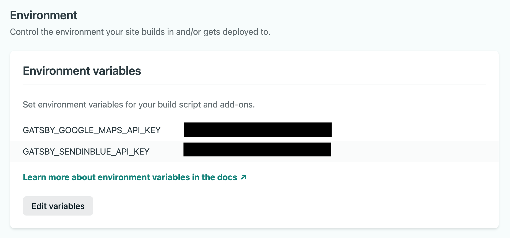

<p align="center">
  <a href="https://www.alliantum.es">
    
      <h1 align="center" >Alliantum.es Site</h1>
  </a>
</p>


This site uses the following external resources:

  - **[Netlify](https://www.netlify.com/)**
  - **[Google Maps](https://developers.google.com/maps/documentation/javascript/get-api-key)**
  - **[Sendinblue](https://www.sendinblue.com/)**


# Repository Usage Instructions

## 1.  **Installing Node Modules.**

    npm install

## 2.  **Creating a ```.env.development``` file.**

  

## 3.  **Adding API Keys to the file.**

- This file contains the API Keys for Google Maps and Sendinblue.

- Add your keys in the following way:

  ```GATSBY_GOOGLE_MAPS_API_KEY=<YOUR_GOOGE_MAPS_API_KEY>```

  ```GATSBY_SENDINBLUE_API_KEY=<YOUR_SENDINBLUE_API_KEY>```


- Add these variables as Environment Variables in your Netlify Site Project:

  


- What are they used for?

  **[Google Maps](https://developers.google.com/maps/documentation/javascript/get-api-key)**: This API key is needed to render the maps in the following components:
    
    - GoogleMaps
    - OfficeCard

  **[Sendinblue](https://www.sendinblue.com/)**: 
  
  Sendinblue is platform for email marketing service.

  This API key is needed to receive the contact details of the users that are interested in receiving new job offers to their emails. These users filled the form of the component ' NotifyMeButton '. 

  

  All users contact details will be received in a dashboard table:

  


## 4.  **Setting Sendinblue Lists.**

When users fill the form to receive new job offers they have to choose the job positions they are interested in from a multi-select menu. The 'Lists' Sendinblue's functionality is set so that the contact details are sent in different job position lists.

  

The job positions list list can be found in data.js:

```    
export const allDepartmentsReactSelect = [
    { id: 10, value: "All Positions", label: "All Positions" },
    { id: 7, value: "Digital Marketing", label: "Digital Marketing" },
    { id: 6, value: "Business Systems", label: "Business Systems" },
    { id: 5, value: "HR", label: "HR" },
    { id: 4, value: "IT", label: "IT" }
]
```

The job position id must be equal to the one given by sendinblue to that specific job position list.

## 5.  **Receiving Job Applications.**

Netlifty Forms functionality is set to receive the applicant details from the form in the 'ApplyForm' Component.

```shell
<form name="contact" method="post" data-netlify="true" data-netlify-honeypot="bot-field">
    <input type="hidden" name="form-name" value="contact" />
    ...
    <button type="submit" >Send Message</button>
</form>
```
- All form submissions will be stored in a Netlify dashboard in the 'Forms' section. The 'value' attribute sets the name of your dashboard.

- More information regarding Netlify Forms setup can be found by clicking [here](https://docs.netlify.com/forms/setup/).


## 6. Scripts

  **Loading the Site.**

- For Development Purposes: **`gatsby develop`**

 Your site is now running at `http://localhost:8000`


- For Building Puroposes: **`gatsby build`**

    ```shell
    gatsby serve
    ```
 Your site is now running at `http://localhost:9000`

