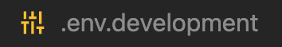
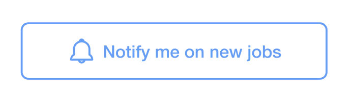
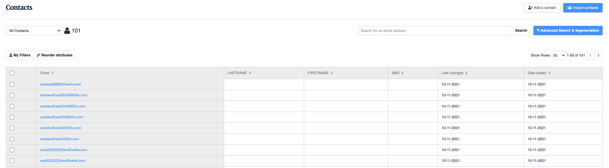
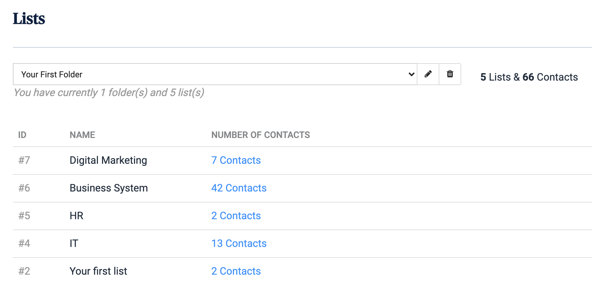

<p align="center">
  <a href="https://www.alliantum.es">
    
  </a>
</p>
<h1 align="center">
  Alliantum.es Site
</h1>

This is the Site Project for Alliantum.es.


### Repository Usage Instructions

## 1.  **Installing Node Modules.**

    npm install

## 2.  **Creating a ```.env.development``` file.**

  

## 3.  **Adding API Keys to the file.**

- This file contains the API Keys for Google Maps and Sendinblue.

- Add your keys in the following way:

  ```GATSBY_GOOGLE_MAPS_API_KEY=<YOUR_API_KEY>```

  ```GATSBY_SENDINBLUE_API_KEY=<YOUR_API_KEY>```

- What are they used for?

  **[Google Maps](https://developers.google.com/maps/documentation/javascript/get-api-key)**: This API key is needed to render the maps in the following components:
    
    - GoogleMaps
    - OfficeCard

  **[Sendinblue](https://www.sendinblue.com/)**: 
  
  Sendinblue is platform for email marketing service.

  This API key is needed to receive the contact details of the users that are interested in receiving new job offers to their emails. These users filled the form of the component ' NotifyMeButton '. 

  

  All users contact details will be received in a dashboard table:

  


## 4.  **Setting Sendinblue Lists.**

When users fill the form to receive new job offers they have to choose the department they are interested in. The 'Lists' Sendinblue's functionality is set so that the contact details are sent in different office departments list.

  

The departments list can be found in the component 'NotifyMeButton'.

```    
const departmentsLists = [
        { name: "IT", id: 4 },
        { name: "HR", id: 5 },
        { name: "Business System", id: 6 },
        { name: "Digital Marketing", id: 7 }
    ]
```

## 5.  **Receiving Job Applications.**

Netlifty Forms functionality is set to receive the applicant details from the form in the 'ApplyForm' Component.

```shell
<form name="contact" method="post" data-netlify="true" data-netlify-honeypot="bot-field">
    <input type="hidden" name="form-name" value="contact" />
    ...
    <button type="submit" >Send Message</button>
</form>
```
- All form submissions will be stored in a Netlify dashboard in the 'Forms' section. The 'value' attribute sets the name of your dashboard.

- More information regarding Netlify Forms setup can be found by clicking [here](https://docs.netlify.com/forms/setup/).


## 6. Scripts

  **Loading the Site.**

- For Development Purposes: **`gatsby develop`**

 Your site is now running at `http://localhost:8000`


- For Building Puroposes: **`gatsby build`**

    ```shell
    gatsby serve
    ```
 Your site is now running at `http://localhost:9000`

